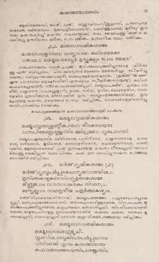
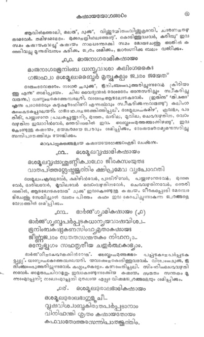

# Image Binarisation from pdf

This code snippnet converts scanned pdf documents into binary images. 
It uses OTSU thresholding and masking to acheive the result. 

### Usage

The program expects the following
  - pdf to be converted named ```input pdf```
  - empty folders ```in in2 and out```
  
 To run the program, run the shell script 
 
 ``` 
 chmod +x run.py
 ./run.py
 
 ```
 
 ### Dependencies 
 
  - opencv
  - pdf2image
  - img2pdf

## Results

 
